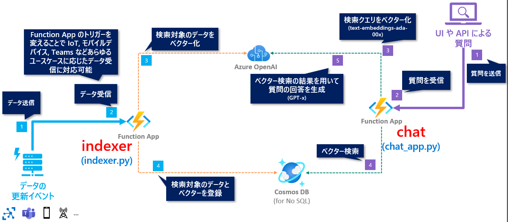

# Azure OpenAI Service x RAG パターン実践ハンズオン: Python 編

## 💫 概要とゴール

このハンズオンでは、以下を習得することがゴールです。

- **Cosmos DB for NoSQL でのベクター検索機能** の利用方法。
  - 2024年5月に開催されたカンファレンス Microsoft Build で発表された機能です。
  - 独自のデータを、ベクター検索が可能な検索インデックスとして作成する方法を学びます。
- Retrieval Augmented Generation (RAG) パターンでの回答生成

開発言語は Python を利用します。  
独自データのサンプルとして、このリポジトリの[data/azure-info.json](./data/azure-info.json)にある Azure のサービスの一覧の情報を利用し、検索インデックスを作成します。

 

## 🗺️ アーキテクチャ構成

ハンズオンで実現するアーキテクチャ構成は以下となります。

Azure OpenAI Service、Cosmos DB と Function App で以下のプログラムを実装して、ハンズオンのゴールを目指します。

API (Function App) | 説明
--- | ---
**Indexer** (図:左側) | ベクター検索ができるように Cosmos DB へデータを登録
**chat** (図:右側) | 受け付けた質問に対して、Cosmos DB でベクター検索をし、その結果を用いて LLM で回答を生成

 

## 🚧 Azure のリソース作成時の注意

> [!WARNING]
> 今回のハンズオンでは、Auzre のリソースを作成することで料金が発生するリソースもあります。ご自身の状況に応じて、今回のハンズオンの最後にリソースグループごとすべて消すなどは自己責任で行なってください。

 

## 🔖 ハンズオンの構成

以下の構成でハンズオンを進めます。

タイトル | 概要
--- | ---
[🧪 S1. Azure OpenAI Service のセットアップ](./docs/setup-azure-openai.md) | ハンズオンで利用する Azure OpenAI Service のリソースをセットアップします。
[🧪 S2. Azure のリソースをセットアップ](./docs/setup-azure-resources.md) | ハンズオンで利用する Cosmos DB と Function App のリソースをセットアップします。
[🧪 D1. テンプレートのコードをセットアップ](./docs/setup-function-app-code.md) | Codespace でハンズオンで利用する Function App のコードのテンプレートで、環境変数の設定などをセットアップします。
[🧪 D2. indexer.py の実装](./docs/implement-indexer.md) | ベクター検索のインデックスとなるデータを Cosmos DB へ更新する処理を実装します。
[🧪 D3. chat_app.py の実装](./docs/implement-chat.md) | RAG パターンでの回答生成を実装します。
[🧪 D4. Azure へのデプロイ](./docs/deploy-to-azure.md) | Azure Functions へデプロイして動作確認をします。
[🚮 Azure のリソース削除](./docs/remove-azure-resources.md) | Azure のリソースを削除する方法を説明します。

 

## 🛠️ 事前準備

GitHub アカウントと Azure のサブスクリプションが必要です。

## 🧑‍💻 Let's Get Started

以下のリンクからハンズオンの旅に出発しょう🚀

- [🧪 S1. Azure OpenAI Service のセットアップ](./docs/setup-azure-openai.md)
