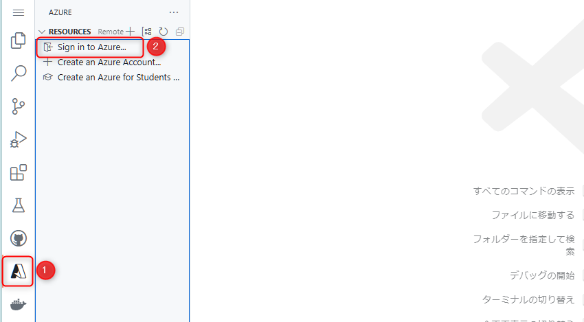
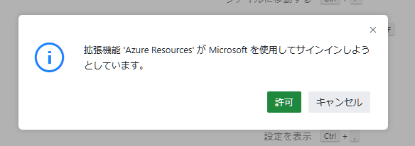
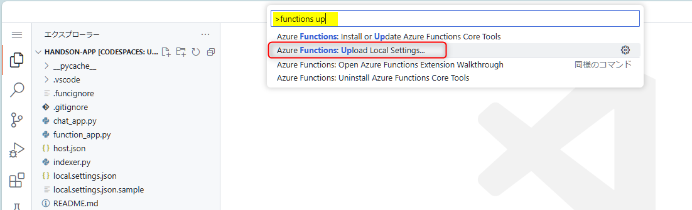
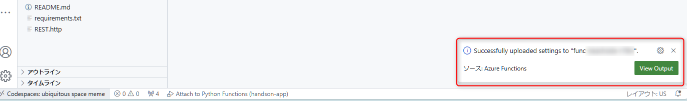
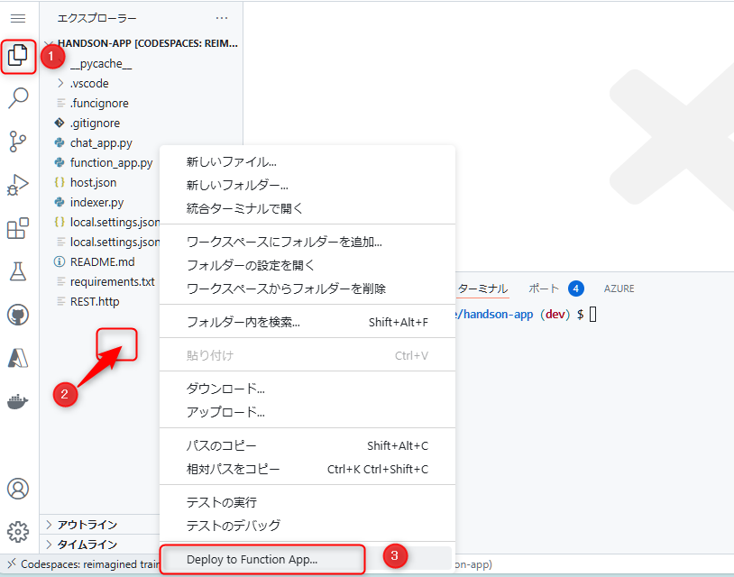
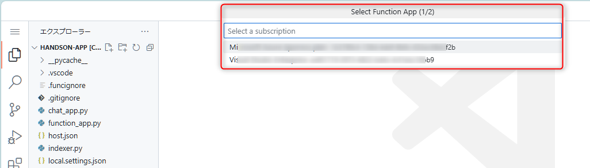
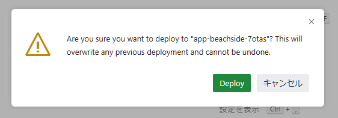
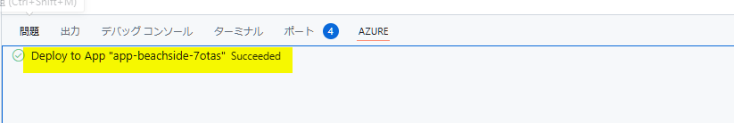
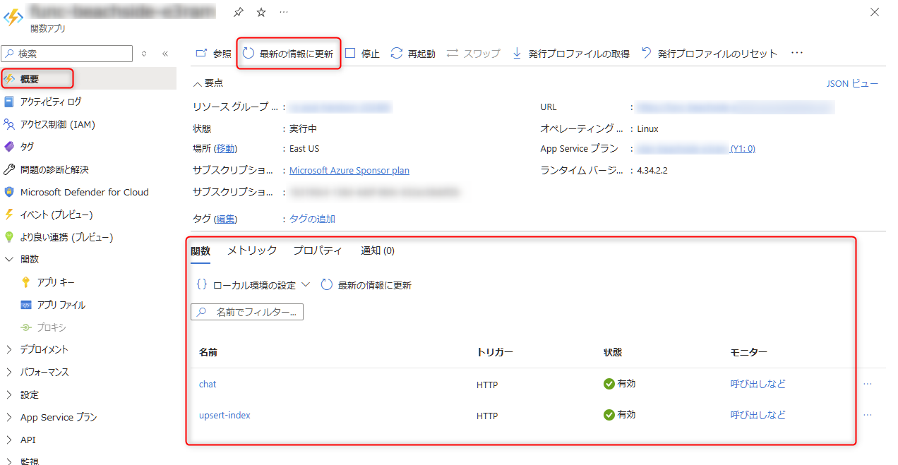
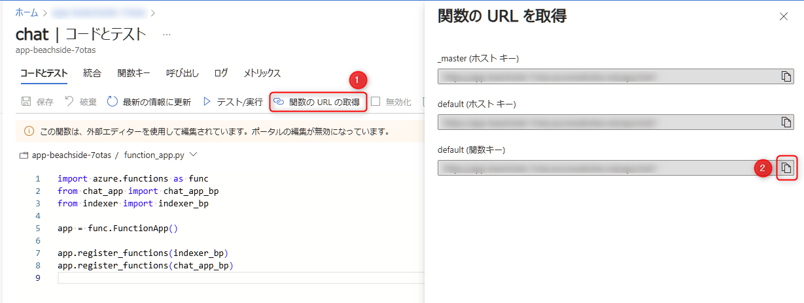

# 🧪 D4. Azure へのデプロイ: Function App

ここでは、VS Code の拡張機能を使って Azure 上の Function App へデプロイし、クラウド上で API が正常に動作することを確認します。

- [D4-1. Azure への Sign in の確認](./deploy-to-azure.md#-d4-1-azure-への-sign-in-の確認)
- [D4-2. D4-2. Function App の環境変数を更新](./deploy-to-azure.md#-d4-2-function-app-の環境変数を更新)
- [D4-3. Function App へデプロイ](./deploy-to-azure.md#-d4-3-function-app-へデプロイ)
- [D4-4. Function App の実行](./deploy-to-azure.md#-d4-4-function-app-の実行)


## 🔖 D4-1. Azure への Sign in の確認

最初に Codespace で Azure へのサインインを確認します。

Codespace の右側にある Azure のアイコンをクリックし (①)、"Sign in to Azure" をクリックします (②)。

> [!NOTE]
> この時点で Azure のサブスクリプションの一覧が表示されている場合、既に Sign in が完了していますので、次の [D4-2. Function App へデプロイ](./deploy-to-azure.md#-d4-2-function-app-へデプロイ) へ進みます。



<br>

ポップアップが表示された場合は、"許可" をクリックします。その後ブラウザで Azure のサインインが求められますので画面にしたがって操作を進めます。




以下の画面が表示されたら正常にサインインができています。このタブを閉じて Codespace へ戻ります。


<br>

## 🔖 D4-2. Function App の環境変数を更新

Function App にデプロイする前に、local.settings.json に設定されている環境変数を Azure 上の Function App に反映させます。

Codespace で VS Code のコマンドパレットを開き (Windows: `CTRL` + `SHIFT` + `P`, Mac: `Cmd` + `SHIFT` + `P`) 、「functions upload」と入力すると、"Azure Functions: Upload local settings" が表示されますので選択します。



サブスクリプション、Function App の選択が求められますので、今回利用するサブスクリプションと作成した Function App を選択します。
選択後、環境変数のアップロードが開始されます。以下図のように Codespace の右下にメッセージが表示されたら完了です。




## 🔖 D4-3. Function App へデプロイ

次の手順で操作を進めます。

- Codespace の右側のエクスプローラーアイコンをクリックし (①) します。
- エクスプローラーの何もない部分で右クリックし (②) 、"Deploy to Function App..." をクリックします (③)。数秒すると、コマンドパレットが表示されます。



<br>

- コマンドパレットで、デプロイする Azure のサブスクリプションの選択が表示されますので、今回利用するサブスクリプションを選択します。



- サブスクリプションを選択すると、次にデプロイする Function App を選択します。
- 選択後、数秒待つと以下のポップアップが表示されますので、"Deploy" をクリックします。これでデプロイが開始されます。



デプロイが完了すると、以下のようなメッセージが表示されたら正常に完了です。




## 🔖 D4-4. Function App の実行

デプロイした Function App を実行して動作確認します。

### Azure portal で Function App の確認

Azure portal で Function App のリソースを開き、左側のメニュー "概要" で以下のように関数が表示されていることを確認します。

> [!NOTE]
> この表示の反映にはすぐ表示されることや10分程度時間がかかることがありますので、休憩などしてから、画面上部の **"最新の情報に更新"** や ブラウザをリロードしてご確認ください。



<br>

以下の画面が表示されます。

- "関数の URL を取得" をクリックし (①)、表示された画面で "default (関数キー)" の URL をコピーします (②)。




### REST.http で Chat の API の動作確認

Codespace に戻り、REST.http を開き、上部に以下コードを追加します。また、以下の説明を参考に追加します。

- `@functionUrl` に先ほどコピーしたご自身の URL をセットします。
- クエリ文字列 `q` の内容は任意に設定して "Send Request" をクリックして動作確認をしましょう。

```curl
### chat (Function App)

# TODO: ここにコピーした function app の url をセット
@functionUrl=https://func-xxxxx.azurewebsites.net/api/chat?

GET {{functionUrl}}q=ウェブをホストするサービスを教えて

```

> [!NOTE]
> 興味がありましたら、indexer も以前のハンズオン内容を参考に動作確認をお試しください。

<br>

## ✨ Congratulations ✨

おめでとうございます🎉。ワークショップのすべてのセクションが修了しました。

最後に Azure のリソースの削除方法について説明します。

---

[⏮️ 前へ](./implement-chat.md) | [📋 目次](../README.md) | [⏭️ 次へ](./remove-azure-resources.md)
