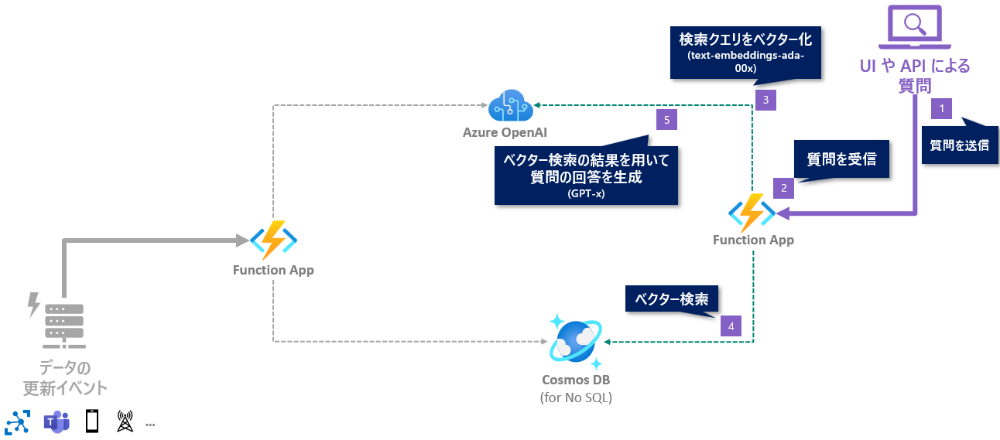

# 🧪 D3. chat_app.py の実装

**chat_app.py** で、RAG パターンのチャットを実装します。

- [D3-1. ベクター検索の実装](./implement-chat.md#-d3-1-cosmos-db-でのベクター検索の実装)
- [D3-2. RAG パターンでの回答生成](./implement-chat.md#-d3-2-rag-パターンでの回答生成)
- [NEXT STEP](./implement-chat.md#️-next-step-)



<br>

## 🔖 D3-1. Cosmos DB でのベクター検索の実装

エクスプローラーから **chat_app.py** を開き、Cosmos DB でのベクター検索を実装します。

### 実装: ベクター検索

以下の実装をします。

- HTTP リクエストから質問文を取得
- 質問文をベクター化
- Cosmos DB でベクター検索を実行するメソッドを作成
- ここまでの動作確認として、ベクター検索の結果を返す

実装するコードは以下の通りです。  
> ※ chat_app.py のコードをすべて消し、以下コードを貼り付ければ OK です。

```python
# こちらへの対応: https://github.com/microsoft/Oryx/issues/1774
try:
    import azure.functions as func
    from azure.cosmos import CosmosClient
    from openai import AzureOpenAI
    import os
    import json
except:
    pass

chat_app_bp = func.Blueprint()

aoai_client = AzureOpenAI(
    azure_endpoint=os.environ["AOAI_ENDPOINT"],
    api_key=os.environ["AOAI_API_KEY"],
    api_version=os.environ["AOAI_API_VERSION"]
)
cosmos_client = CosmosClient.from_connection_string(os.environ["COSMOS_CONNECTION"])
container = cosmos_client.get_database_client(os.environ["COSMOS_DB_NAME"]).get_container_client(os.environ["COSMOS_CONTAINER_NAME"])


@chat_app_bp.function_name(name="chat")
@chat_app_bp.route(route="chat", methods=["GET"], auth_level=func.AuthLevel.ANONYMOUS)
def chat(req: func.HttpRequest) -> func.HttpResponse:
    # 質問の文章の取得: クエリ文字列 query の値
    question = req.params.get("q")
    # 質問の文章がない場合は BadRequest を返す
    if not question:
        return func.HttpResponse("クエリ文字列 'q' で質問文を指定してください。", status_code=400)
    
    # ベクター検索の結果を取得
    contents = vector_search(question)

    # 動作確認: ベクター検索の結果を返す
    return func.HttpResponse(contents)


def vector_search(text: str) -> str:
    # テキスト(質問文)をベクター化
    text_vector = aoai_client.embeddings.create(input=text, model=os.environ["AOAI_DEPLOYMENT_NAME_ADA"]).data[0].embedding
    # Vector search の結果から上位@k件を取得、score は @score 以上でフィルター
    query = "SELECT TOP @k c.id, c.title, c.content, c.category, VectorDistance(c.contentVector, @vector) AS similarityScore FROM c" \
        + " " + "WHERE VectorDistance(c.contentVector, @vector) > @score" \
        + " " + "ORDER BY VectorDistance(c.contentVector, @vector)"

    search_results = container.query_items(
        query=query,
        parameters=[
            {"name": "@vector", "value": text_vector},
            {"name": "@k", "value": 3},
            {"name": "@score", "value": 0.2}
        ],
        enable_cross_partition_query = True
    )

    # Vector search の結果を JSON フォーマットの文字列で返す
    return json.dumps(list(search_results))

```

<br>

### デバッグ実行: ベクター検索

Function App をデバッグ実行します。

> [!NOTE]
> エディターにカーソルを当てた状態で `F5` キーを押すとデバッグ実行が開始します。または VS Code 左側のアイコン "Run and Debug" からデバッグ実行できます。

REST.http を開き、`### chat` の部分で、クエリ文字列 `q` に質問文をセットして `Send Request` をクリックして API をコールします。  
実行の例は以下です。

```curl
GET http://localhost:7071/api/chat?q=ウェブのサービス
```

以下を確認します。

- ✅ Function App が、エラーなく正常に起動すること。
- ✅ REST.http から API をコールし、ベクター検索の結果が返ってくること。

動作確認が完了したら、Codespace でデバッグを終了します。

> [!NOTE]
> デバッグの終了方法は、[こちらのページの下部 "デバッグの終了"](./setup-function-app-code.md#デバッグの終了) に記載があります。

次は、この検索結果を使って LLM で回答を生成します。

<br>

## 🔖 D3-2. RAG パターンでの回答生成

引き続き **chat_app.py** で、ベクター検索の結果を使って回答を生成するコードを実装します。  
> ※ chat_app.py のコードをすべて消し、以下コードを貼り付ければ OK です。

### 実装: 回答の生成

```python
# こちらへの対応: https://github.com/microsoft/Oryx/issues/1774
try:
    import azure.functions as func
    from azure.cosmos import CosmosClient
    from openai import AzureOpenAI
    import os
    import json
except:
    pass

chat_app_bp = func.Blueprint()

aoai_client = AzureOpenAI(
    azure_endpoint=os.environ["AOAI_ENDPOINT"],
    api_key=os.environ["AOAI_API_KEY"],
    api_version=os.environ["AOAI_API_VERSION"]
)
cosmos_client = CosmosClient.from_connection_string(os.environ["COSMOS_CONNECTION"])
container = cosmos_client.get_database_client(os.environ["COSMOS_DB_NAME"]).get_container_client(os.environ["COSMOS_CONTAINER_NAME"])


@chat_app_bp.function_name(name="chat")
@chat_app_bp.route(route="chat", methods=["GET"], auth_level=func.AuthLevel.ANONYMOUS)
def chat(req: func.HttpRequest) -> func.HttpResponse:
    # 質問の文章の取得: クエリ文字列 query の値
    question = req.params.get("q")
    # 質問の文章がない場合はエラーにする
    if not question:
        return func.HttpResponse("クエリ文字列 'q' で質問文を指定してください。", status_code=400)
    
    # ベクター検索の結果を取得
    contents = vector_search(question)
    # 回答を生成
    answer = generate_answer(question, contents)
    return func.HttpResponse(answer)


def vector_search(text: str) -> str:
    # テキスト(質問文)をベクター化
    text_vector = aoai_client.embeddings.create(input=text, model=os.environ["AOAI_DEPLOYMENT_NAME_ADA"]).data[0].embedding
    # Vector search の結果から上位@k件を取得、score は @score 以上でフィルター
    query = "SELECT TOP @k c.id, c.title, c.content, c.category, VectorDistance(c.contentVector, @vector) AS similarityScore FROM c" \
        + " " + "WHERE VectorDistance(c.contentVector, @vector) > @score" \
        + " " + "ORDER BY VectorDistance(c.contentVector, @vector)"

    search_results = container.query_items(
        query=query,
        parameters=[
            {"name": "@vector", "value": text_vector},
            {"name": "@k", "value": 3},
            {"name": "@score", "value": 0.2}
        ],
        enable_cross_partition_query = True
    )
    # 動作確認用: vector search の結果をログへ出力
    # logging.info(json.dumps(list(search_results), indent=2))
    
    # Vector search の結果を JSON フォーマットの文字列で返す
    return json.dumps(list(search_results))


def generate_answer(question: str, contents: str) -> str:

    system_message = f"""
    あなたは Microsoft Azure の専門家です。
    あなたのタスクは、Microsoft Azure に関する質問にのみに回答することです。
    回答は日本語で生成します。
    以下の "contents" tag 内の情報だけを参考にして回答を生成します。

    <contents>
    {contents}
    </contents>
    """

    messages = [
        {"role": "system", "content": system_message},
        {"role": "user", "content": question}
    ]

    completions = aoai_client.chat.completions.create(
        model=os.environ["AOAI_DEPLOYMENT_NAME_GPT"],
        messages=messages,
        temperature=0
    )

    return completions.choices[0].message.content

```

### デバッグ実行: 回答の生成

Function App をデバッグ実行します。

> [!NOTE]
> エディターにカーソルを当てた状態で `F5` キーを押すとデバッグ実行が開始します。または VS Code 左側のアイコン "Run and Debug" からデバッグ実行できます。

REST.http を開き、`### chat` の部分で、クエリ文字列 `q` に Azure のサービスに関する質問文をセットして `Send Request` をクリックして API をコールします。  
実行の例は以下です。

```curl
GET http://localhost:7071/api/chat?q=ウェブをホストするサービスを教えて
```

以下を確認します。

- ✅ Function App が、エラーなく正常に起動すること。
- ✅ REST.http から API をコールし、質問の回答が返ってくること。

動作確認が完了したら、Codespace でデバッグを終了します。

> [!NOTE]
> デバッグの終了方法は、[こちらのページの下部 "デバッグの終了"](./setup-function-app-code.md#デバッグの終了) に記載があります。

<br>

## ⏭️ NEXT STEP ✨

おめでとうございます🎉。これで RAG パターンを活用して LLM で回答を生成することが実現できました。


次で最後のセクションとなります。Azure 上の Function App へコードをデプロイして、クラウド上での動作確認を行います。


---

[⏮️ 前へ](./implement-indexer.md) | [📋 目次](../README.md) | [⏭️ 次へ](./deploy-to-azure.md)
