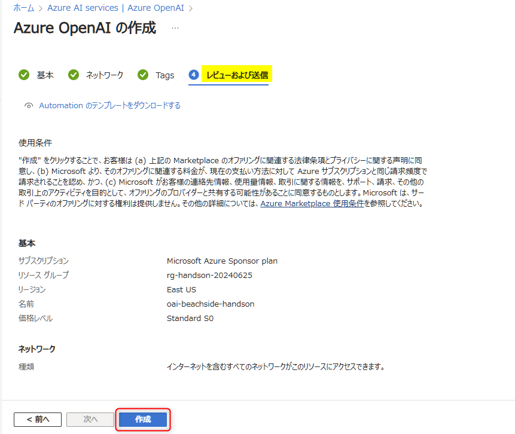
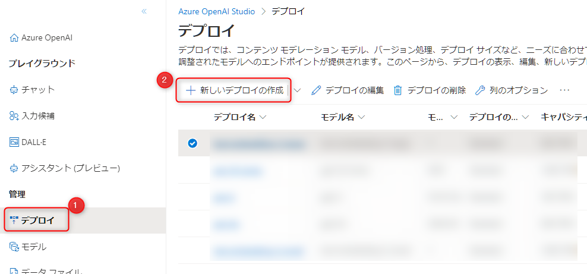
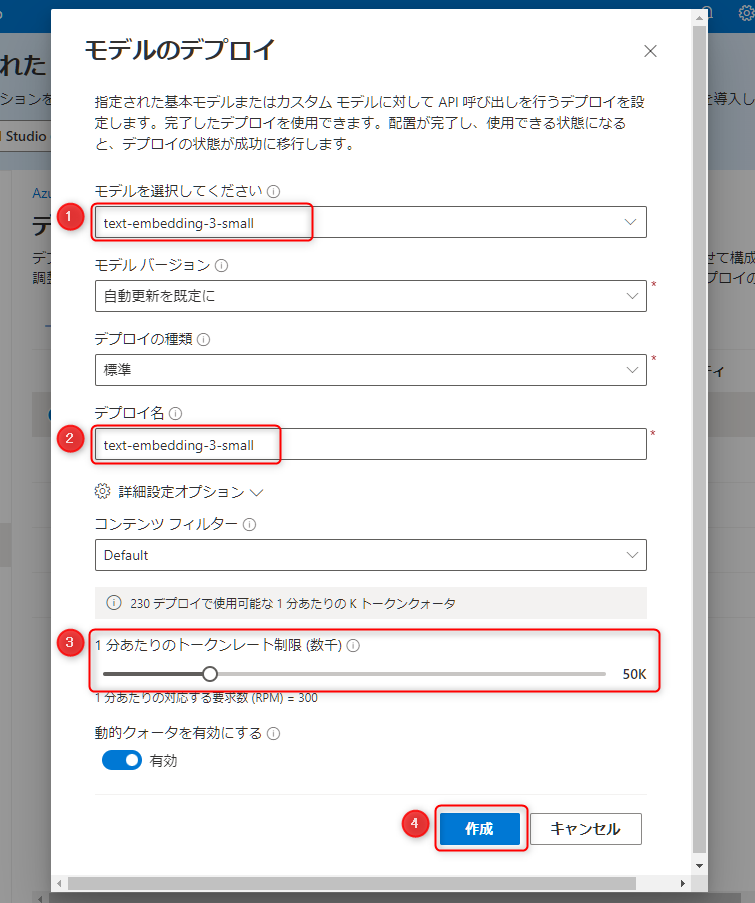
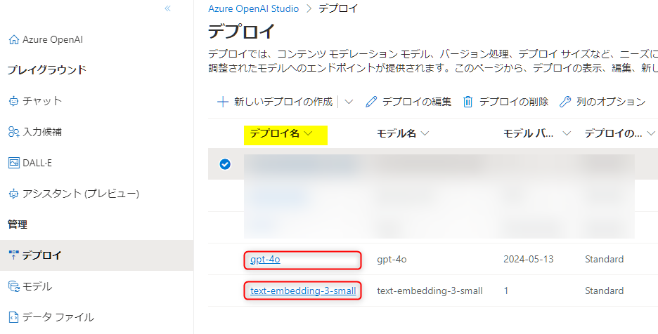

# 🧪 S1. Azure OpenAI Service のセットアップ

ここでは、Azure OpenAI Service のリソースの作成とモデルのデプロイを行ないます。

- [S1-1. Azure OpenAI Service のリソースの作成](./setup-azure-openai.md#-s1-1-azure-openai-service-のリソースの作成)
- [S1-2. モデルのデプロイ](./setup-azure-openai.md#-s1-2-モデルのデプロイ)
- [NEXT STEP](./setup-azure-openai.md#️-next-step-)

## 🔖 S1-1. Azure OpenAI Service のリソースの作成

**※ すでに Azure OpenAI Service のリソースを作成済みの場合は、このセクションを飛ばして、次の [S1-2. モデルのデプロイ](./setup-azure-openai.md#-s1-2-モデルのデプロイ) からお進みください。**

Azure portal (`portal.azure.com`) を開き、上部の検索で「azure openai」と入力して表示される "Azure OpenAI" をクリックします。

 

Azure OpenAI Service の一覧が表示されますので、"作成" をクリックします。

 

Azure OpenAI の作成画面になります。以下を参考に入力します。"次へ" をクリックします。

No.  | 項目 | 入力内容
---: | --- | ---
1 | サブスクリプション | 任意のサブスクリプションを選択します。
2 | リソースグループ | "新規作成" をクリックし、任意の名前を入力します。例: `rg-handson-yyyymmdd` (yyyymmdd は本日の日付)
3 | リージョン | 今回は、GPT-4o が利用可能なリージョンのひとつである 「**East US**」を選択します。(特別な理由があれば別のリージョンでも問題ありません。)
4 | 名前 | 任意の名称を入力します。これはグローバルで一意の名称になる必要があります。例:「oai-xxxx-handson-eastus2」( "xxx" は自分のハンドルネームや任意のプロジェクト名など) 。
5 | 価格レベル | "Standard S0" を選択します。

> [!TIP]
> GPT-4 シリーズのモデルが利用できるリージョンについては以下に記載があります。
>
> - [GPT-4 および GPT-4 Turbo モデルの可用性 (Azure OpenAI Service モデル) | Microsoft Learn](https://learn.microsoft.com/ja-jp/azure/ai-services/openai/concepts/models#gpt-4-and-gpt-4-turbo-model-availability)

"ネットワーク" と "タグ" はデフォルトの設定のままで "次へ" をクリックして "レビューおよび送信" まで進み、"作成" をクリックします。

 

これで Azure OpenAI Service のリソース作成は完了です。リソースの作成が完了したら、"リソースに移動" をクリックします。

 

## 🔖 S1-2. モデルのデプロイ

ここでは、ハンズオンで利用する2つのモデルをデプロイします。  
以下2つのモデルでデプロイ済みでそれを利用したい場合は、このセクションを飛ばして [NEXT STEP](./setup-azure-openai.md#️-next-step-) に進んでください。

1. Embeddings モデルのデプロイ (`text-embedding-3-small`、利用できない場合は `text-embedding-ada-002`)
2. GPT モデルのデプロイ (`gpt-4o`、利用できない場合は `gpt-35-turbo` などの任意の GPT モデル)

### Embeddings モデルのデプロイ

Embeddings で利用する `text-embedding-3-small` のモデルのデプロイを行います。

Azure OpenAI のリソースが表示されたら "概要" の上部にある "Go to Azure OpenAI Studio" をクリックして Azure OpenAI Studio に移動します。

 

以下の手順でモデルのデプロイの準備をします。

- Azure OpenAI Studio の左メニュー "デプロイ" をクリック (①) します。
- "新しいデプロイの作成" (②) をクリックします。

 

"モデルのデプロイ" 画面が表示されます。

- "モデルを選択してください" で "text-embedding-3-small" を選択します (①)。
  - "text-embedding-3-small" が利用できない場合は、"text-embedding-ada-002" を選択します。
- "デプロイ名" には、モデルと同様の「text-embedding-3-small」を入力します (②)。
  - モデルが "text-embedding-ada-002" の場合は「text-embedding-ada-002」と入力します。
- "1分あたりのトークンレート制限 (数千)" は、50k 以上の任意の値にします (③)。
- "Create (作成)" をクリックしてデプロイを開始します (④)。

### GPT モデル のデプロイ

前述と同様の手順で、GPT のモデルをデプロイします。

- "gpt-4o" が利用可能な場合は、"gpt-4o" を選択しデプロイを進めます。
- "gpt-4o" が利用できない場合 (モデルの選択で表示されない場合) は、"gpt-35-turbo" などの任意の GPT モデルを選択します。
- 前述同様 "デプロイ名" は、可能であればモデル名と同じにします。

> [!TIP]
> gpt-35-turbo や gpt-4 はバージョンが新しい方がコストも性能も高い傾向にあります。詳細は以下のドキュメントで確認できます。
>
> - [Azure OpenAI Service モデル | Microsoft Learn](https://learn.microsoft.com/ja-jp/azure/ai-services/openai/concepts/models)

 

最後に、左メニューの "デプロイ" をクリックして2つのモデルがデプロイされていることが確認します。

**この2つのデプロイ名は、後続のステップで利用しますので、メモしておきます。**

 

## 📚 参考情報

- [Azure OpenAI Service モデル | Microsoft Learn](https://learn.microsoft.com/ja-jp/azure/ai-services/openai/concepts/models)
- [Azure OpenAI Service のクォータと制限](https://learn.microsoft.com/ja-jp/azure/ai-services/openai/quotas-limits#regional-quota-limits)
- [Azure OpenAI Service のクォータを管理する | Microsoft Learn](https://learn.microsoft.com/ja-jp/azure/ai-services/openai/how-to/quota?tabs=terraform)

## ⏭️ NEXT STEP ✨

おめでとうございます！最初の一歩として Azure OpenAI Service のセットアップが完了しました。  
続けて他に必要な Azure のリソースのセットアップを進めます。

---

[📋 目次](../README.md) | [⏭️ 次へ](./setup-azure-resources.md)
