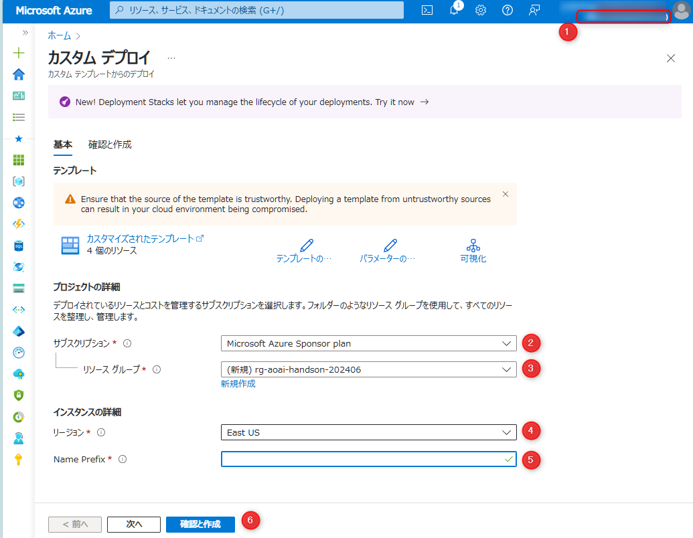
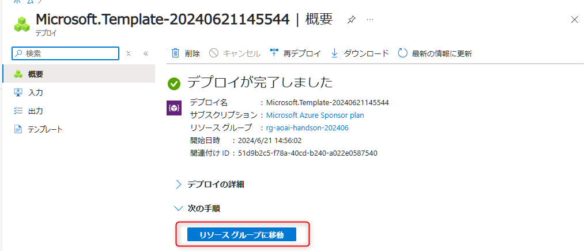
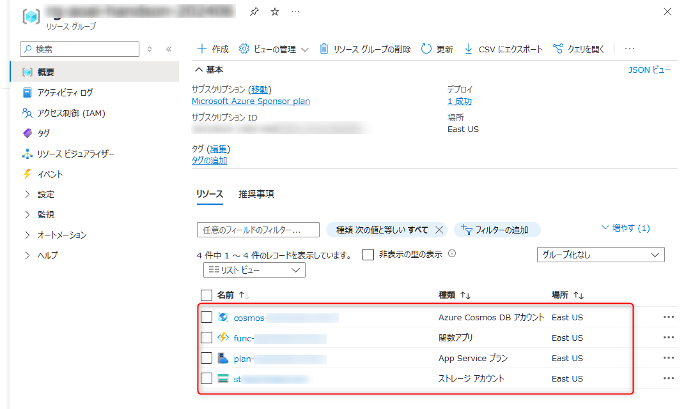
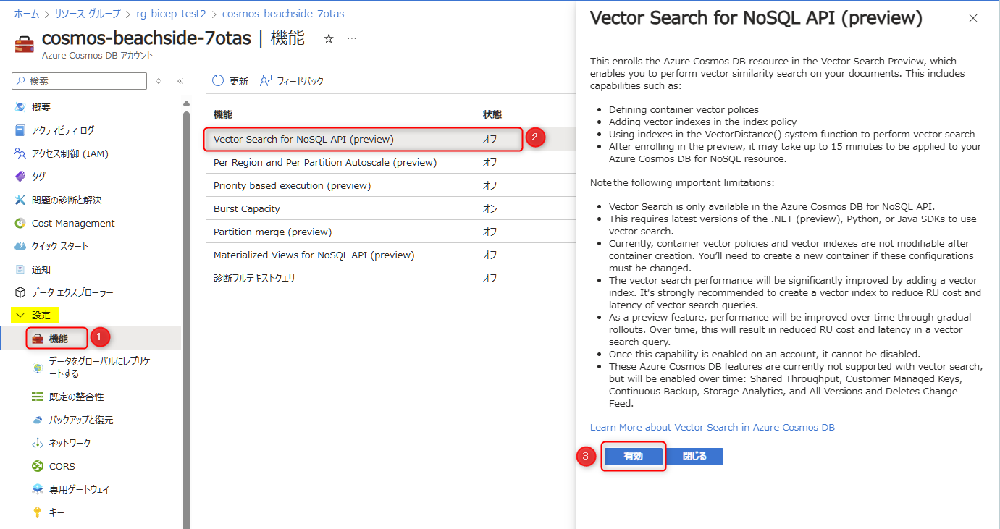
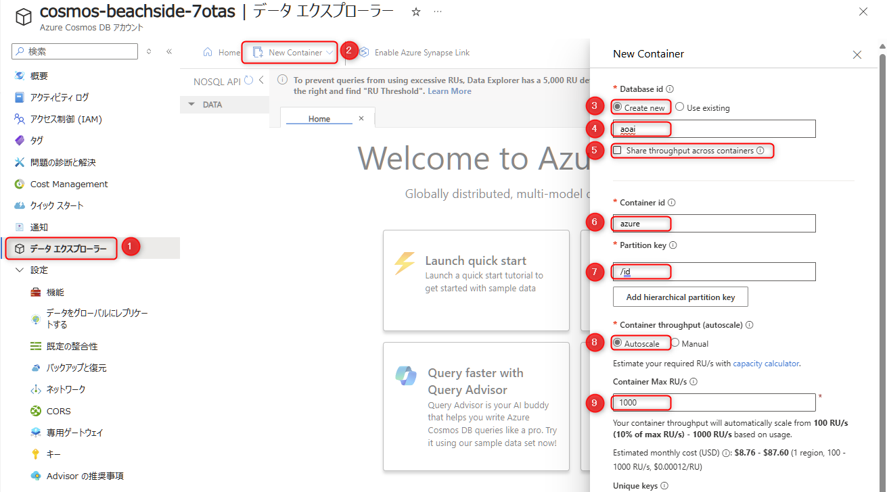
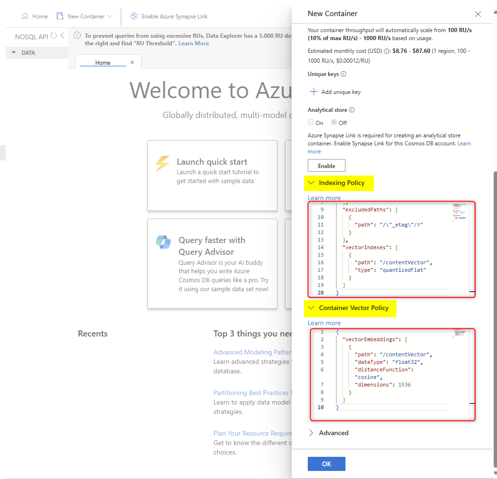

# 🧪 S2. Azure のリソースをセットアップ

ここでは、以下のステップで Azure OpenAI Service 以外の3つのリソースをセットアップします。

- [S2-1. ARM template からリソース作成](./setup-azure-resources.md#-s2-1-arm-template-からリソース作成)
- [S2-2. Cosmos DB: Vector Search 機能の有効化](./setup-azure-resources.md#-s2-2-cosmos-db-vector-search-機能の有効化)
- [S2-3. Azure Cosmos DB: データベース・コンテナーの作成](./setup-azure-resources.md#-s2-3-cosmos-db-データベースコンテナーの作成)
- [NEXT STEP](./setup-azure-resources.md#️-next-step-)

## 🔖 S2-1. ARM template からリソース作成

ハンズオンで利用する以下のリソースを作成します。

- Azure Cosmos DB
- Azure Functions

以下の `Deploy to Azure` のボタンを `CTRL` キー (Mac の場合 `CMD`) を押しながらクリックすることで、別タブで Azure portal に遷移してカスタムデプロイの画面が開きます。


<a href="https://portal.azure.com/#create/Microsoft.Template/uri/https%3A%2F%2Fstyokosandbox.blob.core.windows.net%2Farm-templates%2Faoai-workshop-cosmos-template.json" target="_blank" rel="noopener noreferrer"></a>


<br>

カスタムデプロイ画面では、以下を参考に入力し、"確認と作成" (⑥)をクリックします。

No. | 項目 | 入力内容
---: | --- | ---
1 | 開いている Azure のディレクトリ | ハンズオンで利用するディレクトリであることを確認します。異なる場合は正しいディレクトリを変更します。
2 | サブスクリプション | ハンズオンで利用するサブスクリプションを選択します。
3 | リソース グループ | 既存で使うリソースグループがある場合は選択します。新たに作成したい場合は "新規作成" を選択して名称を入力します。
4 | リージョン | ハンズオンで利用するリージョンを選択します。Azure OpenAI のセットアップで説明した通り "East US" を推奨していますが、自身で判断して利用するリージョンを選択してください。
5 | Name Prefix | リソースにつける任意のプリフィックスを入力します。文字列と数字のみで入力してください。



<br>

"確認と作成" タブで "作成" ボタンをクリックすると、リソースの作成が開始されます。リソースの作成には数分かかりますので、しばらくお待ちください。

リソースが作成できたら、"リソースグループに移動" をクリックして、作成したリソースを確認します。



<br>

リソースグループで、Cosmos DB と Function App のリソースが作成されていることが確認できます。



<br>

> [!NOTE]
> エラーが出た場合は、エラー内容を確認の上作成したリソースをすべて削除して作り直すか、ハンズオンのメンターにご相談ください。


## 🔖 S2-2. Cosmos DB: Vector Search 機能の有効化

前述から引き続きリソースグループで、Cosmos DB のリソースをクリックして表示して以下の操作をします。

- 左メニュー "設定" 内にある "機能" をクリックし (①) 、"Vector Search for NoSQL API (preview)" をクリックします (②)。
- 有効化する画面が表示されますので、"有効" をクリックします (②)。
- 5-10分程度で機能が有効化されます。




## 🔖 S2-3. Cosmos DB: データベース・コンテナーの作成

"Vector Search for NoSQL API (preview)" の有効化が完了したら、引き続き Azure Portal の Cosmos DB のリソースで以下の操作をします。

左メニュー "データエクスプローラー" をクリック (①) → "New Container" をクリックして (②)、New Container のペインで以下を参考に入力します。

 No. | 項目 | 入力内容
---: | --- | ---
3 | Database id (Create new) | "Create new" を選択します。
4 | Database id | 「aoai」と入力します。
5 | Share throughput across containers | チェックを**オフ**にします。
6 | Container id | 「azure」と入力します。
7 | Partition key | 「/id」と入力します。
8 | Container throughput (autoscale) | "Autoscale" を選択します。
9 | Container Max RU/s | 「1000」と入力します。



<br>

ここまで入力が終わったら下の方へスクロールし、さらに下の方にある **Index Policy** と **Container Vector Policy** を展開して値を入力します。

> [!CAUTION]
> 「Index Policy」「Container Vector Policy」のどちらのメニューも表示されていない場合は、Vector Search の有効化が完了していない場合に発生します。5分程度待ってからリロードしてお試しください。  
> どちらか片方のメニューのみ表示される場合は、UI が新しくなっている場合に発生します。その場合は、以下の内容を参考に入力するか、入力方法をメンターにご確認ください。


**Index Policy**の値は以下です。

```json
{
  "indexingMode": "consistent",
  "automatic": true,
  "includedPaths": [
    {
      "path": "/*"
    }
  ],
  "excludedPaths": [
    {
      "path": "/\"_etag\"/?"
    }
  ],
  "vectorIndexes": [
    {
      "path": "/contentVector",
      "type": "quantizedFlat"
    }
  ]
}
```

**Container Vector Policy** の値は以下です。

```json
{
  "vectorEmbeddings": [
    { 
      "path": "/contentVector", 
      "dataType": "float32", 
      "distanceFunction": "cosine", 
      "dimensions": 1536
    }
  ]
}
```

入力後、下部にある "OK" ボタンをクリックすると、コンテナーが作成されます。




<br>

Cosmos DB のセットアップは以上です。のちほどこの画面から各種の確認をするので、ブラウザのタブはこのまま開いておきます。

<br>

## 📚 参考情報

Cosmos DB for NoSQL の Vector search 関連:

- [ベクトル データベース | Microsoft Learn](https://learn.microsoft.com/ja-jp/azure/cosmos-db/vector-database)
- [Azure Cosmos DB for NoSQL におけるベクトル検索 (プレビュー) | Microsoft Learn](https://learn.microsoft.com/ja-jp/azure/cosmos-db/nosql/vector-search)

Cosmos DB 全般:

- [Azure Cosmos DB の概要 | Microsoft Learn](https://learn.microsoft.com/ja-jp/azure/cosmos-db/introduction)
- [Azure Cosmos DB で API を選択する | Microsoft Learn](https://learn.microsoft.com/ja-jp/azure/cosmos-db/choose-api)
- [Azure Cosmos DB のデータベース、コンテナー、アイテム | Microsoft Learn](https://learn.microsoft.com/ja-jp/azure/cosmos-db/resource-model)
- [Azure Cosmos DB の要求ユニット(RU) | Microsoft Learn](https://learn.microsoft.com/ja-jp/azure/cosmos-db/request-units)
- [Azure Cosmos DB のデータ モデリング](https://learn.microsoft.com/ja-jp/azure/cosmos-db/nosql/modeling-data)
- [Azure Cosmos DB でのパーティション分割と水平スケーリング | Microsoft Learn](https://learn.microsoft.com/ja-jp/azure/cosmos-db/partitioning-overview)

<br>

## ⏭️ NEXT STEP ✨

おめでとうございます🎉。ワークショップで利用するすべての Azure のリソースの準備が完了しました。次はコードの実装に進みます。

[⏮️ 前へ](./setup-azure-openai.md) | [📋 目次](../README.md) | [⏭️ 次へ](./setup-function-app-code.md)
