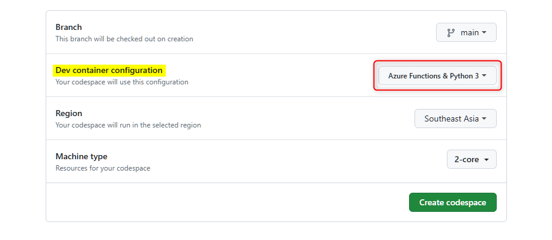
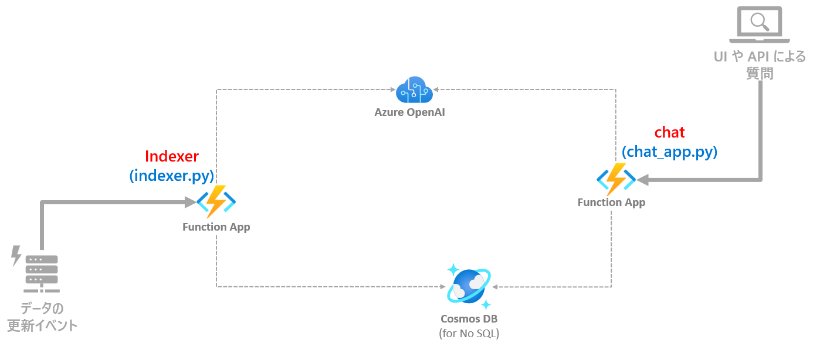
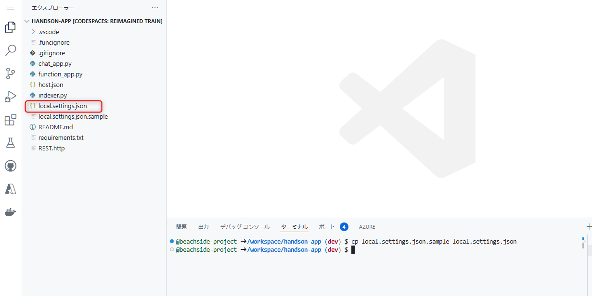
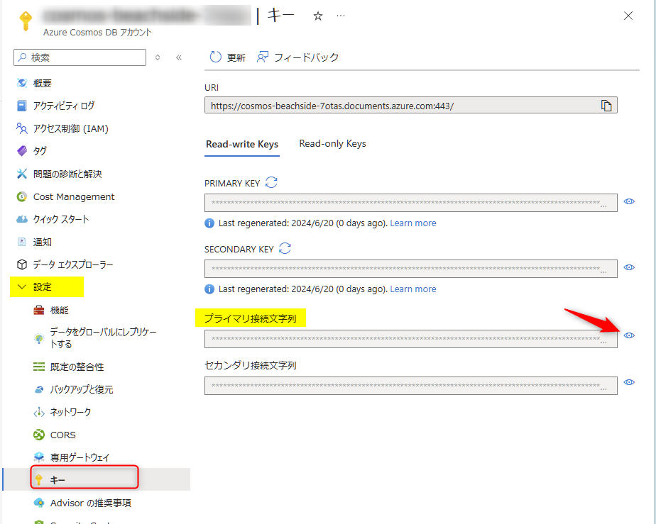
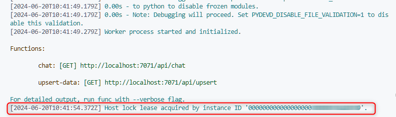
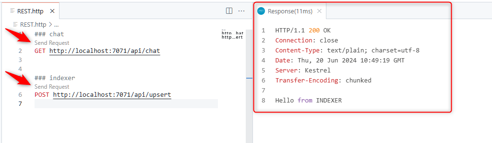
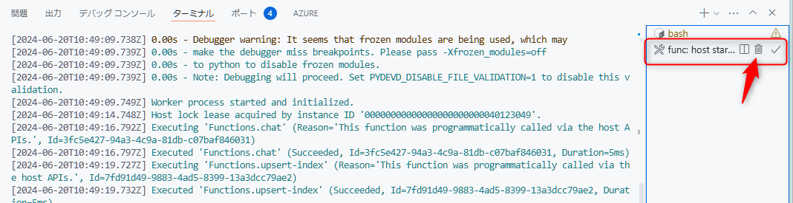

# 🧪 D1. テンプレートのコードをセットアップ

**GitHub Codespaces** は、Python などの言語を利用しているときに開発者個々の環境で相違が起きがちな開発環境を制御し、統一して開発を進めることができます。  
このハンズオンは、GitHub の Codespaces のメリットを活かし、全員が統一された開発環境でハンズオンを行ないます。

ここでは、以下のステップで Codespaces の起動確認と `handson-app` がデバッグ実行できるようにセットアップします。

- [D1-1. Codespaces の起動](./setup-function-app-code.md#-d1-1-codespaces-を起動)
- [D1-2. handson-app の構成](./setup-function-app-code.md#-d1-2-handson-app-の構成)
- [D1-3. デバッグ実行の準備](./setup-function-app-code.md#-d1-3-デバッグ実行の準備)
- [D1-4. Function App のデバッグ実行](./setup-function-app-code.md#-d1-4-function-app-のデバッグ実行)
- [NEXT STEP](./setup-function-app-code.md#-next-step-)


<br>


## 🔖 D1-1. Codespaces を起動

ここからは、Function App 専用の GitHub Codespaces を利用してハンズオンを進めます。  

今回のハンズオンの GitHub のリポジトリで、"Code" ボタンをクリック (①) → "Codespaces" をクリック (②) → "..." をクリック (③) → "New with options" をクリック (④) します。


<br>

Create for Codespace の画面が表示されます。"Dev container configuration" で **Azure Functions & Python 3** を選択し "Create codespace" をクリックすると、Codespaces が起動し、ブラウザ上で VS Code が起動します。




<br>

## 🔖 D1-2. handson-app の構成

Codespaces を起動すると、エクスプローラーで `handson-app` フォルダーがルートとして開かれるように設定しています。  
この中にある Function App のコードに、以下2つのトリガーの関数が含まれています。  
この2つを実装することで RAG パターンでの回答生成を実現します。

ファイル名 | トリガー | 概要
--- | --- | ---
chat_app.py | HTTP Trigger | ベクター検索した結果を使って LLM で回答の生成する API を実装します。
indexer.py | HTTP Trigger | Vector Search ができるように Cosmos DB へデータを更新する API 実装します。

> [!TIP]
> 今回はハンズオンでは、操作性の観点から1つの Function App に複数の Function を実装して進めます。本来は、スケーラビリティの観点から Function をまとめるか分けるかを考慮するのがベストプラクティスです。



<br>

## 🔖 D1-3. デバッグ実行の準備

Azure Functions でのローカル開発において、環境変数やシークレットは local.settings.json で構成します。

ここでは、`handson-app` をデバッグ実行するために必要となる local.settings.json をセットアップします。


最初に Codespace 上で `CTRL` + `SHIFT` + `@` キー (Mac の場合 `CTRL` + `SHIFT` + `^`) を押してターミナルを開きます。  
次に以下のコマンドを実行します。下図のように local.settings.json が生成されます。

```bash
cp local.settings.json.sample local.settings.json
```



<br>

生成された local.settings.json を開き、Azure OpenAI Service と Cosmos DB の2つのリソースから情報を取得して設定します。

### 環境変数の設定 1/2: Azure OpenAI Service

#### エンドポイントと API キーの設定

Azure OpenAI Studio ( <https://oai.azure.com/> )を開き、エンドポイントと API キーの2つを設定します。

- 画面上部のギアのアイコン (下図①) をクリック
- リソースタブをクリック (下図②)
- 今回利用するd Azure OpenAI のリソースのエンドポイント (下図③) をコピーします。
- Codespace の local.settings.json で、`AOAI_ENDPOINT` の値にコピーした値を入力します。
- Azure OpenAI Studio に戻り、**キー** (下図④) のボタンをクリックして、キーの値をコピーします。
- Codespace の local.settings.json で、`AOAI_API_KEY` の値にコピーした値を入力します。


#### デプロイ名の設定

local.settings.json では、デプロイした2つのモデル名をデフォルトで設定しています。

- `AOAI_DEPLOYMENT_NAME_ADA`: `text-embedding-3-small`
- `AOAI_DEPLOYMENT_NAME_GPT`: `gpt-4o`

**別のデプロイ名を設定している場合は、この値を自身で利用するデプロイ名に変更してください。**


<br>

### 環境変数の設定 2/2: Cosmos DB

Azure Portal (<https://portal.azure.com/>) を開き、今回利用する Cosmos DB のリソースを開きます。

- 左側のメニューで "設定" を展開して "キー" (下図①)をクリックし、「プライマリ接続文字列」の右側にある目のアイコン (下図②) をクリックします。
- 接続文字列が表示されるのでコピーします。
- Codespace 上で local.settings.json を開き、`COSMOS_CONNECTION` の値に、コピーした値を入力します。



<br>

## 🔖 D1-4. Function App のデバッグ実行

### デバッグの開始

デバッグ実行をします。Codespace 内のエディターにカーソルを当てた状態で `F5` キーを押すと、デバッグを実行します。(または VS Code 左側のアイコン "Run and Debug" からデバッグを実行できます。)

> [!CAUTION]
**デバッグ開始時に「タスク 'func: host start' を見つけられませんでした。」が表示された場合**
>
> VS Code のコマンドパレットを開き (Windows: `CTRL` + `SHIFT` + `P`, Mac: `Cmd` + `SHIFT` + `P`) 、「reload」と入力して表示される **開発者: ウィンドウの再読み込み" (Developer: Reload Window)** を実行することで解消する可能性が高いです。

ターミナルでは以下図のように「Host lock lease acquired by ...」と表示されたら正常にデバッグ実行が開始できています。



<br>

REST API のエンドポイントが2つありますので、以下の手順で動作を確認します。

- Codespace 上で REST.http というファイルを開きます。
- chat と indexer の2つのエンドポイントをそれぞれ実行します。それぞれの "Send Request" をクリックすることで実行できます。
- 下図のように正常に HTTP Status Code 200 で応答が返ってくることを確認します。




### デバッグの終了

デバッグを終了するには、ターミナルの右側に表示されている「func host ...」にカーソルをあて、ゴミ箱のアイコン (強制終了) をクリックします。




<br>

## 📚 参考情報

このワークショップでは Function App の詳細は時間の都合のため開設を省略しています。参考情報としてドキュメントの一部を紹介します。

- [Azure Functions の概要 - Microsoft Learn](https://learn.microsoft.com/ja-jp/azure/azure-functions/functions-overview?pivots=programming-language-python)
- [Azure Functions でのトリガーとバインドの概念 | Microsoft Learn](https://learn.microsoft.com/ja-jp/azure/azure-functions/functions-triggers-bindings?tabs=isolated-process%2Cpython-v2&pivots=programming-language-python)
- [Azure Functions 開発者ガイド | Microsoft Learn](https://learn.microsoft.com/ja-jp/azure/azure-functions/functions-reference?tabs=blob&pivots=programming-language-python)
- [クイックスタート: Visual Studio Code と Python を使用して Azure に関数を作成する | Microsoft Learn](https://learn.microsoft.com/ja-jp/azure/azure-functions/create-first-function-vs-code-python?pivots=python-mode-decorators)
- [Azure Functions のベストプラクティス | Microsoft Learn](https://learn.microsoft.com/ja-jp/azure/azure-functions/functions-best-practices?tabs=csharp)

<br>

## ⏭️ NEXT STEP ✨

おめでとうございます🎉。これでハンズオンを実装するための準備ができました。  
次は、2つの Function の中でデータを更新する Indexer.py から実装を進めます。

---

[⏮️ 前へ](./setup-azure-resources.md) | [📋 目次](../README.md) | [⏭️ 次へ](./implement-indexer.md)
